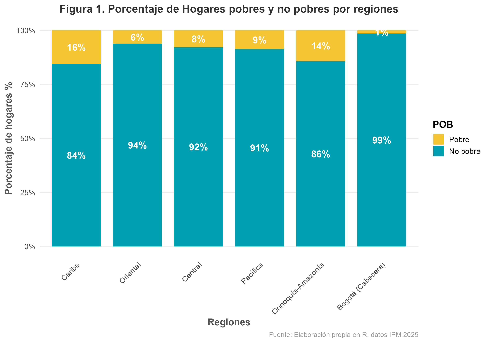
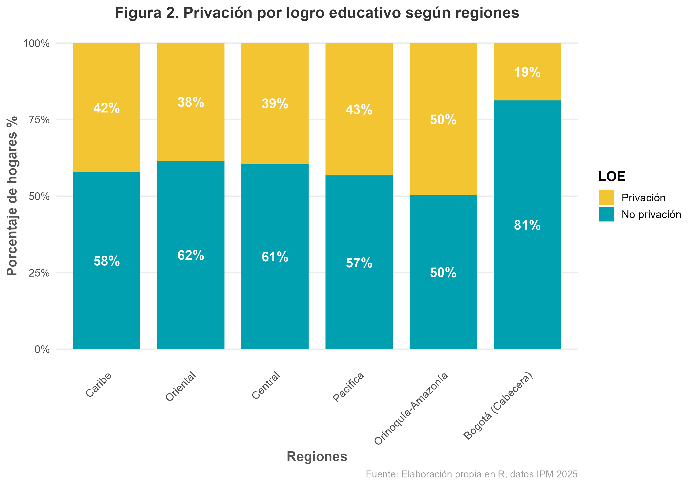
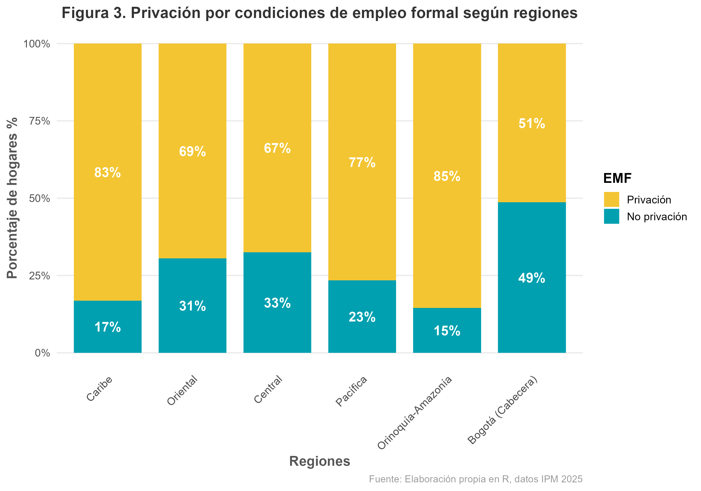
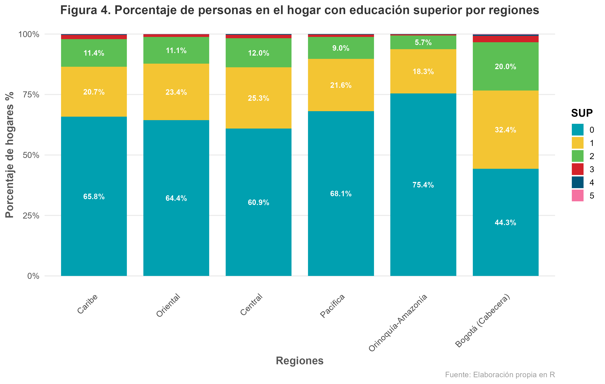
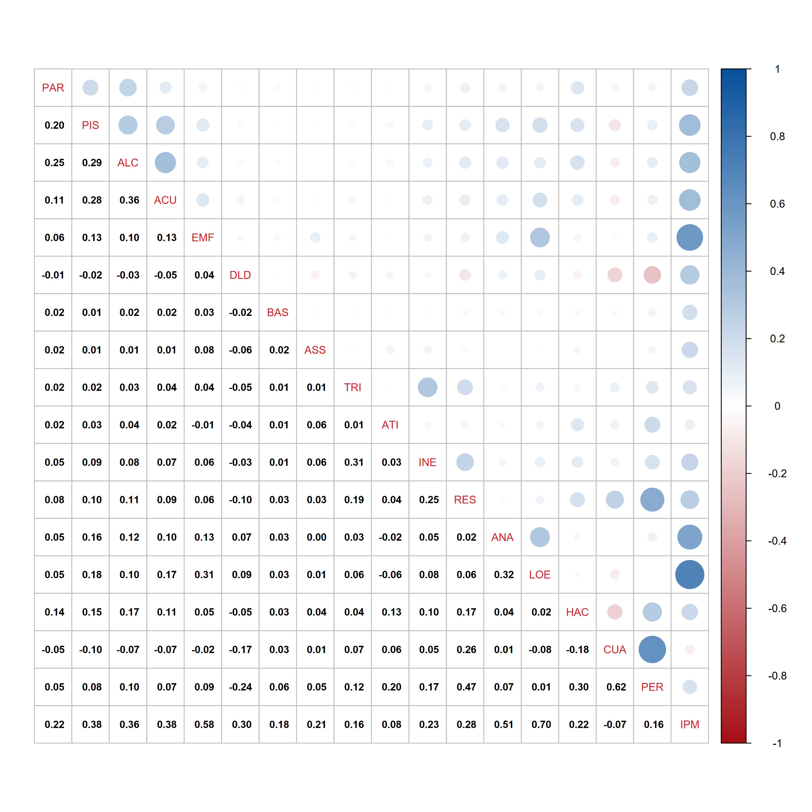
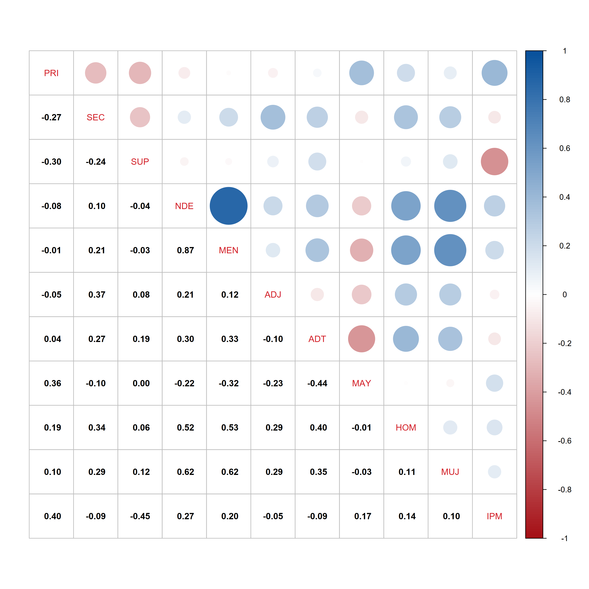
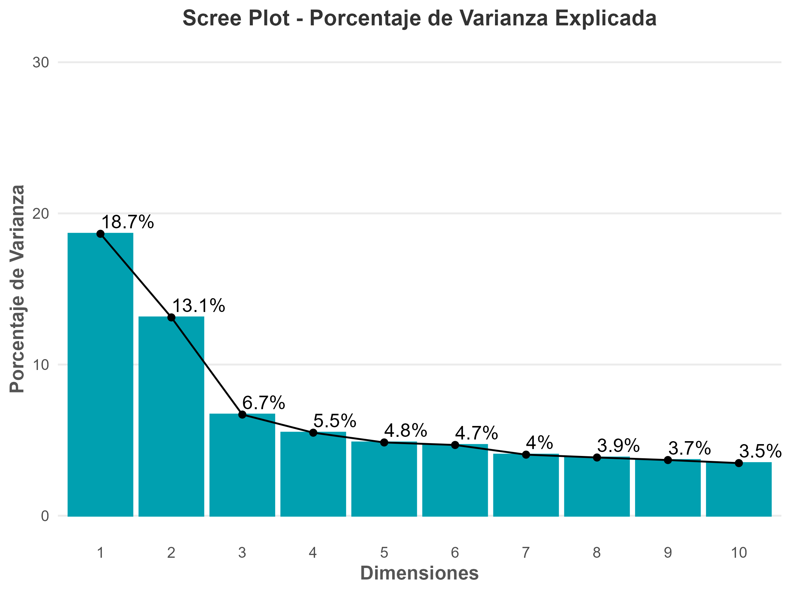
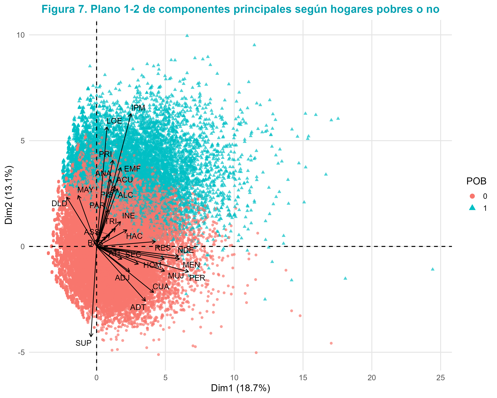
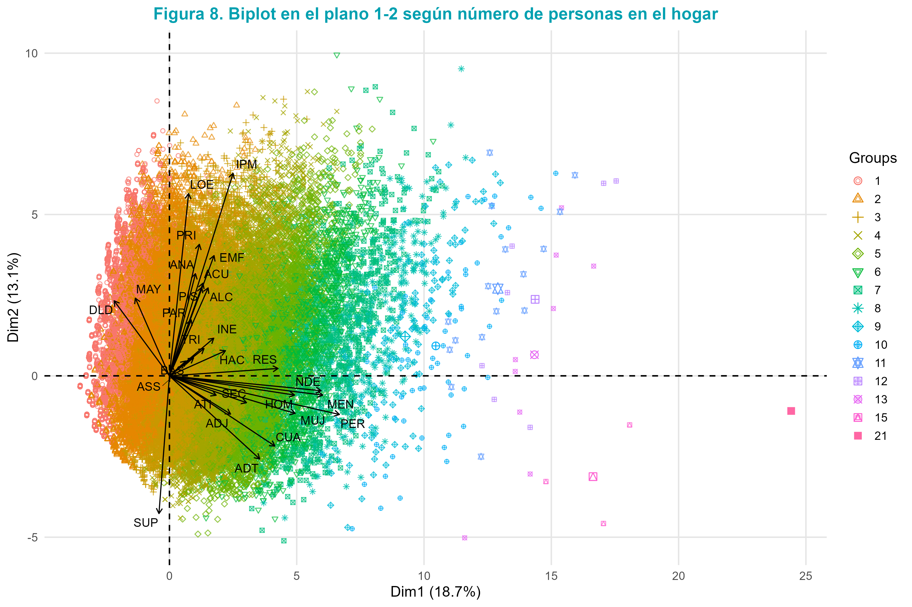
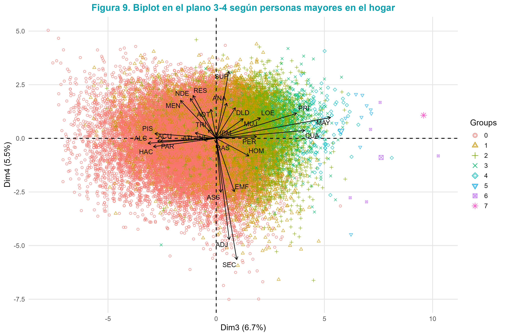

```{r setup, include=FALSE}
Sys.setlocale("LC_CTYPE", "Spanish_Colombia.UTF-8")
library(openxlsx)
library(gt)
library(dplyr)
library(scales)
library(tibble)
```

```{css, echo=FALSE}
:root {
  --dm-violet: #7C3AED;
  --dm-blue: #2563EB;
  --dm-cyan: #06B6D4;
  --dm-green: #10B981;
  --dm-ink: #111827;
  --dm-muted: #4B5563;
  --dm-line: #E5E7EB;
  --dm-paper: #F8FAFC;
  --dm-soft-blue: #EFF6FF;
  --dm-soft-cyan: #ECFEFF;
}
body {
  background:
    linear-gradient(90deg, rgba(124, 58, 237, 0.035), transparent 22%, transparent 78%, rgba(6, 182, 212, 0.035)),
    #ffffff;
  color: var(--dm-ink);
}
.quarto-title-banner {
  padding-top: 3.2rem;
  padding-bottom: 3.2rem;
}
#title-block-header {
  display: none;
}
.quarto-title-block,
#title-block-header.quarto-title-block.default .quarto-title {
  max-width: 760px;
  margin-left: auto;
  margin-right: auto;
}
.quarto-title-block .title {
  font-weight: 800;
  letter-spacing: 0;
}
.subtitle {
  color: #e7f6f8;
  font-size: 1.1rem;
}
.cover-pro {
  position: relative;
  overflow: hidden;
  background:
    radial-gradient(circle at 92% 10%, rgba(6, 182, 212, 0.38), transparent 26%),
    radial-gradient(circle at 5% 15%, rgba(124, 58, 237, 0.35), transparent 32%),
    linear-gradient(135deg, #111827 0%, #1E1B4B 46%, #2563EB 100%);
  color: #ffffff;
  border: 1px solid rgba(255, 255, 255, 0.14);
  border-radius: 16px;
  padding: 1.55rem 1.65rem;
  margin: 1.35rem 0 3rem;
  box-shadow: 0 18px 42px rgba(6, 50, 56, 0.2);
}
.cover-brand {
  display: flex;
  align-items: center;
  justify-content: space-between;
  gap: 1rem;
  margin-bottom: 0.85rem;
}
.cover-logo {
  width: 54px;
  height: 54px;
  object-fit: contain;
  background: rgba(255, 255, 255, 0.92);
  border-radius: 14px;
  padding: 0.38rem;
  box-shadow: 0 14px 30px rgba(17, 24, 39, 0.22);
}
.cover-pro::before {
  content: "";
  position: absolute;
  inset: 0.7rem;
  border: 1px solid rgba(255, 255, 255, 0.1);
  border-radius: 12px;
  pointer-events: none;
}
.cover-eyebrow {
  display: inline-flex;
  align-items: center;
  gap: 0.45rem;
  color: #BFF6FF;
  font-size: 0.78rem;
  font-weight: 800;
  letter-spacing: 0.08em;
  text-transform: uppercase;
  margin-bottom: 0.75rem;
}
.cover-title {
  color: #ffffff;
  font-size: clamp(1.95rem, 4.2vw, 3.15rem);
  font-weight: 850;
  line-height: 1.02;
  margin: 0;
  max-width: 620px;
}
.cover-subtitle {
  color: #dff8fa;
  font-size: 0.98rem;
  line-height: 1.52;
  max-width: 610px;
  margin: 0.85rem 0 1.1rem;
}
.cover-meta {
  display: flex;
  flex-wrap: wrap;
  gap: 0.45rem;
  margin-bottom: 1.15rem;
}
.cover-chip {
  border: 1px solid rgba(255, 255, 255, 0.2);
  background: rgba(255, 255, 255, 0.09);
  color: #ffffff;
  border-radius: 999px;
  padding: 0.34rem 0.62rem;
  font-size: 0.78rem;
  line-height: 1.2;
}
.cover-grid {
  display: grid;
  grid-template-columns: repeat(4, minmax(0, 1fr));
  gap: 0.55rem;
  margin-top: 0.25rem;
}
.cover-stat {
  background: rgba(255, 255, 255, 0.1);
  border: 1px solid rgba(255, 255, 255, 0.17);
  border-radius: 10px;
  padding: 0.68rem 0.72rem;
  min-height: 76px;
}
.cover-stat strong {
  display: block;
  color: #7DD3FC;
  font-size: 1.16rem;
  line-height: 1;
  margin-bottom: 0.34rem;
}
.cover-stat span {
  display: block;
  color: #e8fbfc;
  font-size: 0.68rem;
  line-height: 1.25;
}
.source-note {
  font-size: 0.88rem;
  color: var(--dm-muted);
  margin-top: 0.9rem;
  margin-bottom: 2rem;
}
.portfolio-note {
  border-left: 5px solid var(--dm-blue);
  background: linear-gradient(90deg, var(--dm-soft-blue), #ffffff);
  padding: 1.15rem 1.25rem;
  margin: 2rem 0 2.4rem;
}
.portfolio-note strong {
  color: var(--dm-blue);
}
.decision-box {
  border: 1px solid var(--dm-line);
  background: linear-gradient(135deg, #ffffff, var(--dm-soft-cyan));
  padding: 1.2rem 1.35rem;
  margin: 2.2rem 0 2.6rem;
}
.decision-box h3 {
  margin-top: 0;
  color: var(--dm-blue);
}
.section-lead {
  font-size: 1.05rem;
  line-height: 1.7;
  color: var(--dm-ink);
  margin-bottom: 1.4rem;
}
main.content,
main#quarto-document-content {
  max-width: 760px !important;
  width: min(760px, calc(100vw - 2rem)) !important;
  margin-left: auto;
  margin-right: auto;
}
main.content p,
main.content li {
  line-height: 1.72;
}
main.content > section {
  margin-top: 4.2rem;
}
main.content > section:first-of-type {
  margin-top: 2rem;
}
main.content h1 {
  margin-top: 4.6rem;
  margin-bottom: 1.4rem;
  padding-top: 0.7rem;
  color: var(--dm-ink);
  border-bottom: 1px solid var(--dm-line);
}
main.content h2 {
  margin-top: 3.1rem;
  margin-bottom: 1rem;
  color: var(--dm-blue);
}
main.content h3 {
  margin-top: 2.4rem;
  margin-bottom: 0.8rem;
  color: var(--dm-violet);
}
.cell {
  margin-top: 1.8rem;
  margin-bottom: 2.6rem;
}
.cell-output-display {
  margin-top: 1.1rem;
  margin-bottom: 1.6rem;
  overflow-x: auto;
}
p > img {
  display: block;
  margin: 1.4rem auto 2rem;
  width: 100%;
  max-width: 760px;
  border-radius: 0.25rem;
}
.quarto-figure,
.figure {
  max-width: 760px;
  margin-left: auto;
  margin-right: auto;
}
.gt_table {
  max-width: 100% !important;
}
h1, h2 {
  letter-spacing: 0;
}
.callout {
  border-radius: 0.45rem;
  margin-top: 1.9rem;
  margin-bottom: 2.4rem;
}
#TOC {
  border-left: 3px solid var(--dm-blue);
}
#TOC .nav-link.active {
  color: var(--dm-blue) !important;
  border-left-color: var(--dm-blue) !important;
}
a {
  color: var(--dm-blue);
}
a:hover {
  color: var(--dm-violet);
}
@media (max-width: 991px) {
  main.content {
    max-width: calc(100vw - 2rem);
  }
  .quarto-title-block,
  #title-block-header.quarto-title-block.default .quarto-title {
    max-width: calc(100vw - 2rem);
  }
  .cover-pro {
    padding: 1.45rem;
    margin-top: 1.2rem;
  }
  .cover-grid {
    grid-template-columns: repeat(2, minmax(0, 1fr));
  }
}
@media (max-width: 520px) {
  .cover-grid {
    grid-template-columns: 1fr;
  }
}
```

```{=html}
<section class="cover-pro">
<div class="cover-brand">
<div class="cover-eyebrow">Portafolio de investigación aplicada</div>

</div>
<h1 class="cover-title">Pobreza Multidimensional en Colombia</h1>
<p class="cover-subtitle">Análisis regional del IPM con microdatos DANE 2025, factores de expansión y lectura multivariada de privaciones sociales.</p>
<div class="cover-meta">
<span class="cover-chip">Daniel José Molina Barrios</span>
<span class="cover-chip">26 de mayo de 2026</span>
<span class="cover-chip">Microdatos DANE 2025</span>
<span class="cover-chip">Analítica social</span>
</div>
<div class="cover-grid">
<div class="cover-stat"><strong>9,9%</strong><span>Incidencia nacional estimada por personas</span></div>
<div class="cover-stat"><strong>5,22 M</strong><span>Personas en hogares pobres multidimensionales</span></div>
<div class="cover-stat"><strong>18,2%</strong><span>Mayor incidencia regional: Amazonía - Orinoquía</span></div>
<div class="cover-stat"><strong>2,2%</strong><span>Menor incidencia regional: Bogotá</span></div>
</div>
</section>
```

# Resumen ejecutivo

**Autor:** Daniel José Molina Barrios  
**Fecha de publicación:** 26 de mayo de 2026  
**Fuente:** microdatos IPM DANE 2025  
**Alcance:** hogares, viviendas, personas, regiones y total nacional

<p class="section-lead">La pobreza multidimensional en Colombia no es solo una cifra nacional: es una desigualdad territorial estructurada. Este informe convierte los microdatos del IPM 2025 en una lectura regional, social y multivariada orientada a decisiones.</p>

Este informe presenta un análisis de la pobreza multidimensional en Colombia a partir de los microdatos del IPM publicados por el DANE para 2025. El objetivo es identificar brechas territoriales, privaciones predominantes y patrones multivariados asociados con la condición de pobreza de los hogares.

El procesamiento integra bases de hogares, viviendas y personas, aplica factores de expansión diferenciados para hogares (`FEX_C`) y personas (`FEXP`), y combina análisis descriptivo regional con matrices de correlación y Análisis de Componentes Principales (PCA). Esta estrategia permite pasar de la lectura de porcentajes aislados a una interpretación estructural de las privaciones.

::: {.callout-important}
## Hallazgo central

La pobreza multidimensional no se distribuye de manera uniforme en el territorio. La incidencia nacional es **9,9%**, pero alcanza **18,2%** en Amazonía - Orinoquía y **17,8%** en Caribe, mientras Bogotá registra **2,2%**.
:::

<div class="portfolio-note">
<strong>Lectura para portafolio.</strong> El valor del proyecto está en pasar de tablas oficiales a una pieza analítica reproducible: integración de microdatos, uso correcto de factores de expansión, construcción de variables, visualización regional y análisis multivariado para explicar perfiles de privación.
</div>

```{r}
#| label: indicadores-clave
kpi_data <- tibble(
  Indicador = c(
    "Incidencia nacional",
    "Personas en hogares pobres",
    "Mayor incidencia regional",
    "Menor incidencia regional"
  ),
  Valor = c("9,9%", "5,22 millones", "18,2%", "2,2%"),
  Lectura = c(
    "Estimación poblacional con factor FEXP",
    "Total nacional expandido",
    "Amazonía - Orinoquía",
    "Bogotá"
  )
)

kpi_data |>
  gt() |>
  tab_header(
    title = md("**Indicadores clave del informe**"),
    subtitle = "Colombia, IPM 2025"
  ) |>
  cols_label(
    Indicador = "Indicador",
    Valor = "Valor",
    Lectura = "Lectura"
  ) |>
  tab_style(
    style = cell_text(weight = "bold", color = "#2563EB", size = px(22)),
    locations = cells_body(columns = Valor)
  ) |>
  tab_style(
    style = cell_fill(color = "#EFF6FF"),
    locations = cells_body(columns = Indicador)
  ) |>
  tab_options(
    table.width = pct(100),
    table.border.top.color = "#2563EB",
    table.border.bottom.color = "#06B6D4",
    heading.align = "left",
    column_labels.font.weight = "bold",
    table.font.size = px(15)
  )
```

```{r}
#| label: insights-ejecutivos
insights_df <- tibble(
  Insight = c(
    "Territorio",
    "Educación",
    "Mercado laboral",
    "Perfil del hogar"
  ),
  Evidencia = c(
    "Amazonía - Orinoquía y Caribe concentran las mayores incidencias regionales.",
    "Bajo logro educativo y menor presencia de educación superior aparecen como ejes persistentes.",
    "La privación por empleo formal opera como una restricción transversal.",
    "Tamaño, composición etaria y presencia de menores ordenan diferencias capturadas por el PCA."
  ),
  Implicacion = c(
    "La priorización territorial debe reconocer brechas regionales, no solo promedios nacionales.",
    "Las trayectorias educativas son una palanca crítica para reducir privaciones acumuladas.",
    "Formalización, protección social y generación de ingresos deben leerse como política antipobreza.",
    "Las intervenciones necesitan segmentar hogares por ciclo de vida y carga demográfica."
  )
)

insights_df |>
  gt() |>
  tab_header(
    title = md("**Cuatro insights estratégicos**"),
    subtitle = "Síntesis interpretativa para lectura ejecutiva"
  ) |>
  cols_label(
    Insight = "Eje",
    Evidencia = "Evidencia analítica",
    Implicacion = "Implicación"
  ) |>
  tab_style(
    style = cell_text(weight = "bold", color = "#2563EB"),
    locations = cells_body(columns = Insight)
  ) |>
  tab_options(
    table.width = pct(100),
    table.border.top.color = "#2563EB",
    table.border.bottom.color = "#06B6D4",
    heading.align = "left",
    column_labels.font.weight = "bold",
    table.font.size = px(14)
  )
```

# Datos y metodología

El análisis utiliza las bases de hogares, viviendas y personas del IPM 2025. Las bases se cruzan mediante identificadores de vivienda y hogar, y luego se construye un dataset integrado con variables de localización, privaciones del hogar, composición demográfica y educación de los integrantes.

La estimación respeta la diferencia entre dos factores de expansión:

- `FEX_C`: factor de expansión de hogares, usado para conteos y análisis a nivel hogar.
- `FEXP`: factor de expansión de personas, usado para incidencia poblacional.

Para evitar desfases de calibración, los totales nacionales se calculan con la base nacional y las comparaciones regionales con la base departamental. Esta separación mejora la consistencia entre el análisis regional y las cifras agregadas del país.

## Variables utilizadas

La Tabla 1 resume las variables usadas para describir las privaciones del hogar, la composición familiar, la educación de las personas y el índice de pobreza multidimensional.

```{r}
#| label: tabla-variables
variables_df <- data.frame(
  Notacion = c(
    "REG", "POB", "PAR", "PIS", "ALC", "ACU", "EMF", "DLD", "BAS", "ASS",
    "TRI", "ATI", "INE", "RES", "ANA", "LOE", "HAC", "CUA", "PER", "IPM",
    "PRI", "SEC", "SUP", "NDE", "MEN", "ADJ", "ADT", "MAY", "HOM", "MUJ"
  ),
  Tipo = c(
    "Localización", "Hogar", "Hogar", "Hogar", "Hogar", "Hogar", "Hogar", "Hogar", "Hogar", "Hogar",
    "Hogar", "Hogar", "Hogar", "Hogar", "Hogar", "Hogar", "Hogar", "Hogar", "Hogar", "Hogar",
    "Personas", "Personas", "Personas", "Personas", "Personas", "Personas", "Personas", "Personas", "Personas", "Personas"
  ),
  Significado = c(
    "Región de localización geográfica del hogar",
    "Condición de pobreza multidimensional del hogar",
    "Privación por material inadecuado de paredes exteriores",
    "Privación por material inadecuado de pisos",
    "Privación por eliminación inadecuada de excretas",
    "Privación por no acceso a fuente de agua mejorada",
    "Privación por empleo formal",
    "Privación por desempleo de larga duración",
    "Privación por barreras de acceso a salud",
    "Privación por no aseguramiento en salud",
    "Privación por trabajo infantil",
    "Privación por atención integral a primera infancia",
    "Privación por inasistencia escolar",
    "Privación por rezago escolar",
    "Privación por analfabetismo",
    "Privación por bajo logro educativo",
    "Privación por hacinamiento crítico",
    "Número de cuartos usados para dormir",
    "Número de personas del hogar",
    "Índice de Pobreza Multidimensional del hogar",
    "Personas con máximo nivel de primaria",
    "Personas con máximo nivel de secundaria",
    "Personas con educación superior",
    "Personas sin declaración de formación académica",
    "Personas menores de 18 años",
    "Personas entre 18 y 29 años",
    "Personas entre 30 y 54 años",
    "Personas de 55 años o más",
    "Personas de sexo masculino",
    "Personas de sexo femenino"
  )
)

variables_df |>
  gt() |>
  cols_label(
    Notacion = "Notación",
    Tipo = "Tipo",
    Significado = "Significado"
  ) |>
  tab_style(
    style = cell_text(weight = "bold", color = "#2563EB"),
    locations = cells_column_labels(everything())
  ) |>
  tab_options(
    table.width = pct(100),
    table.border.top.color = "#2563EB",
    table.border.bottom.color = "#06B6D4",
    table.font.size = "small"
  )
```

# Resultados regionales

## Distribución de hogares y personas

La Tabla 2 muestra los conteos expandidos de hogares y personas por región. El total nacional se calcula con la base nacional calibrada, mientras las filas regionales provienen de la base departamental.

```{r}
#| label: tabla-hogares-personas
t2 <- read.xlsx("resultados/Tablas_Articulo_2025.xlsx", sheet = "Tabla_2_Pobreza")

t2 |>
  gt() |>
  cols_label(
    REG9 = "Región",
    hog_0 = "No pobre",
    hog_1 = "Pobre",
    hog_total = "Total",
    per_0 = "No pobre",
    per_1 = "Pobre",
    per_total = "Total",
    Incidencia_Pct = "Incidencia (%)"
  ) |>
  tab_spanner(
    label = "Hogares",
    columns = c(hog_0, hog_1, hog_total)
  ) |>
  tab_spanner(
    label = "Personas",
    columns = c(per_0, per_1, per_total)
  ) |>
  fmt_integer(
    columns = c(hog_0, hog_1, hog_total, per_0, per_1, per_total),
    locale = "es"
  ) |>
  fmt_number(columns = Incidencia_Pct, decimals = 1, locale = "es") |>
  data_color(
    columns = Incidencia_Pct,
    palette = c("#ECFEFF", "#7C3AED", "#111827"),
    domain = c(0, 20)
  ) |>
  tab_style(
    style = cell_text(weight = "bold", color = "#2563EB"),
    locations = cells_column_labels(everything())
  ) |>
  tab_style(
    style = cell_text(weight = "bold", color = "#2563EB"),
    locations = cells_column_spanners(everything())
  ) |>
  tab_style(
    style = cell_text(weight = "bold"),
    locations = cells_body(rows = REG9 == "Total nacional")
  ) |>
  tab_options(
    table.width = pct(100),
    table.border.top.color = "#2563EB",
    table.border.bottom.color = "#06B6D4",
    table.font.size = "small"
  )
```

<p class="source-note">Fuente: elaboración propia con microdatos IPM DANE 2025.</p>

La brecha territorial es amplia: Amazonía - Orinoquía y Caribe duplican o superan claramente la incidencia nacional, mientras Bogotá se mantiene como un caso atípico de baja incidencia relativa. En volumen absoluto, Caribe concentra más de **2,15 millones** de personas en hogares pobres multidimensionales.

<div class="decision-box">
<h3>Lectura territorial</h3>
<p>El promedio nacional oculta dos Colombias: una zona central con menor incidencia relativa y regiones periféricas donde las privaciones se acumulan con mayor intensidad. Por eso, la comparación regional es más útil para decisiones que una lectura agregada del país.</p>
</div>

## Pobreza por región

{width="100%"}

La figura confirma que la pobreza multidimensional tiene un patrón territorial marcado. Caribe y Amazonía - Orinoquía aparecen como las regiones con mayor participación relativa de hogares pobres, mientras Bogotá conserva la menor proporción.

## Bajo logro educativo

{width="100%"}

El bajo logro educativo es una privación estructural en todas las regiones, pero alcanza niveles especialmente altos en Amazonía - Orinoquía, Caribe y Pacífica. Este resultado sugiere que las brechas educativas no solo acompañan la pobreza, sino que ayudan a explicar su persistencia territorial.

## Empleo formal

{width="100%"}

La privación asociada al empleo formal es una de las más extendidas del análisis. Su alta presencia en regiones periféricas muestra que el mercado laboral sigue siendo un mecanismo central de reproducción de la pobreza multidimensional.

## Educación superior en el hogar

{width="100%"}

La presencia de integrantes con educación superior se comporta como un marcador de ventaja social. Las regiones con menor pobreza tienden a mostrar mayor presencia de educación superior en los hogares, mientras los territorios con mayor incidencia exhiben menor acumulación educativa.

# Estructura multivariada

## Correlaciones

Se elaboraron matrices de correlación para explorar la asociación entre privaciones, composición del hogar e IPM. El color azul indica correlaciones positivas y el rojo indica correlaciones negativas.

{width="85%"}

{width="85%"}

Las correlaciones más relevantes apuntan a dos grupos de variables. Por un lado, las privaciones educativas, laborales y de vivienda se alinean con mayores valores del IPM. Por otro lado, la educación superior se mueve en dirección contraria a la pobreza multidimensional, reforzando su papel como indicador de protección social.

## Análisis de Componentes Principales

El PCA resume las relaciones entre 28 variables del hogar y de sus integrantes. Esta técnica permite observar qué dimensiones latentes organizan la variación entre hogares.

{width="80%"}

### Cargas principales

La Tabla 3 presenta los coeficientes de las cinco primeras componentes. Las cargas muestran que el primer eje se asocia principalmente con tamaño y composición del hogar, mientras el segundo eje concentra variables directamente vinculadas con pobreza, bajo logro educativo, empleo formal e IPM.

```{r}
#| label: tabla-pca
t3 <- read.xlsx("resultados/Tablas_Articulo_2025.xlsx", sheet = "Tabla_3_PCA")

t3 |>
  gt() |>
  tab_header(
    title = md("**Tabla 3. Coeficientes de las cinco primeras componentes principales**"),
    subtitle = "Análisis de Componentes Principales con variables IPM 2025"
  ) |>
  fmt_number(columns = c(Dim1, Dim2, Dim3, Dim4, Dim5), decimals = 3) |>
  opt_stylize(style = 6, color = "gray") |>
  tab_options(table.font.size = "small")
```

Los mayores pesos por componente son consistentes con la lectura sustantiva del fenómeno:

- **Dim1:** tamaño del hogar (`PER`), menores de edad (`MEN`), no declaración educativa (`NDE`) y composición por sexo.
- **Dim2:** IPM, bajo logro educativo (`LOE`), primaria (`PRI`), empleo formal (`EMF`) y educación superior (`SUP`) con signo contrario.
- **Dim3:** presencia de personas mayores (`MAY`), número de cuartos (`CUA`) y variables de vivienda.
- **Dim4 y Dim5:** diferencias educativas y de ciclo de vida que separan perfiles más específicos de hogares.

### Mapas factoriales

{width="100%"}

El plano principal separa hogares según su condición de pobreza multidimensional. Los hogares pobres se orientan hacia variables de privación como IPM, bajo logro educativo y analfabetismo, mientras los hogares no pobres se acercan al vector de educación superior.

{width="100%"}

El tamaño del hogar estructura parte importante de la variación observada. Hogares con más integrantes se desplazan hacia zonas del plano asociadas con mayor complejidad demográfica y mayor presencia de menores.

{width="100%"}

El plano 3-4 permite observar patrones asociados con envejecimiento, cuartos disponibles y composición educativa. Esta lectura complementa el plano principal porque revela diferencias que no dependen únicamente de la condición pobre/no pobre.

# Implicaciones de política pública

<p class="section-lead">Los resultados no señalan una única causa de la pobreza multidimensional; muestran un sistema de privaciones que cambia por territorio, composición del hogar y acumulación educativa.</p>

```{r}
#| label: implicaciones-politica
implicaciones_df <- tibble(
  Prioridad = c(
    "Focalización territorial",
    "Trayectorias educativas",
    "Formalización laboral",
    "Segmentación por ciclo de vida"
  ),
  Hallazgo = c(
    "La incidencia regional supera ampliamente el promedio nacional en Amazonía - Orinoquía y Caribe.",
    "Bajo logro educativo y educación superior ordenan buena parte de las diferencias entre hogares.",
    "La privación por empleo formal se mantiene como una dimensión crítica y extendida.",
    "Tamaño del hogar, menores y personas mayores modifican los perfiles de vulnerabilidad."
  ),
  Recomendacion = c(
    "Priorizar intervenciones diferenciadas por región y no únicamente por indicadores nacionales.",
    "Conectar permanencia escolar, transición a educación superior y formación para el trabajo.",
    "Integrar empleo, ingresos, protección social y cierre de brechas productivas regionales.",
    "Diseñar rutas de atención según composición del hogar, dependencia económica y etapa vital."
  )
)

implicaciones_df |>
  gt() |>
  tab_header(
    title = md("**Implicaciones accionables**"),
    subtitle = "Cómo convertir el diagnóstico en decisiones"
  ) |>
  cols_label(
    Prioridad = "Prioridad",
    Hallazgo = "Hallazgo que la sustenta",
    Recomendacion = "Recomendación"
  ) |>
  tab_style(
    style = cell_text(weight = "bold", color = "#2563EB"),
    locations = cells_body(columns = Prioridad)
  ) |>
  tab_options(
    table.width = pct(100),
    table.border.top.color = "#2563EB",
    table.border.bottom.color = "#06B6D4",
    heading.align = "left",
    column_labels.font.weight = "bold",
    table.font.size = px(14)
  )
```

# Valor agregado del proyecto

<div class="decision-box">
<h3>Capacidades demostradas</h3>
<p>Este trabajo demuestra una ruta completa de analítica social: lectura de documentación técnica, integración de bases, control de factores de expansión, construcción de indicadores, visualización regional, análisis multivariado y comunicación ejecutiva para públicos no técnicos.</p>
</div>

El informe aporta tres elementos que elevan el análisis:

1. **Reproducibilidad:** el flujo conserva una fuente analítica en Quarto/R y genera un HTML autocontenido para publicación.
2. **Escala poblacional:** las estimaciones diferencian hogares y personas mediante `FEX_C` y `FEXP`.
3. **Lectura estructural:** el PCA y las correlaciones complementan los porcentajes descriptivos para entender patrones de privación.

# Alcance y limitaciones

Este informe debe leerse como un análisis exploratorio y descriptivo de corte transversal. No estima relaciones causales ni evalúa el efecto de programas específicos. Sus resultados dependen de la calidad de los microdatos disponibles, de la correcta aplicación de los factores de expansión y de la comparabilidad entre bases nacionales y departamentales.

La principal fortaleza del ejercicio está en ordenar la evidencia para identificar prioridades analíticas y territoriales. Su siguiente paso natural sería profundizar por departamentos, estimar perfiles de hogares mediante segmentación y construir un tablero interactivo para consulta pública.

# Conclusiones

1. La pobreza multidimensional en Colombia presenta una concentración territorial clara. Amazonía - Orinoquía y Caribe son las regiones con mayor incidencia, mientras Bogotá muestra una situación muy distinta frente al promedio nacional.
2. Las privaciones educativas y laborales son los ejes más relevantes del análisis. Bajo logro educativo, informalidad laboral y baja presencia de educación superior aparecen como factores decisivos para entender la posición de los hogares.
3. La composición del hogar también importa. El tamaño del hogar, la presencia de menores y la estructura por edades organizan parte de la variación capturada por el PCA.
4. La lectura integrada de tablas, gráficos y componentes principales permite priorizar intervenciones: mejorar logro educativo, ampliar trayectorias hacia educación superior y fortalecer empleo formal en regiones con mayor rezago.

::: {.callout-tip}
## Cierre ejecutivo

La evidencia sugiere que reducir la pobreza multidimensional exige combinar focalización territorial, política educativa, formalización laboral y atención diferencial a la composición de los hogares. La medición nacional es el punto de partida; la lectura regional y multivariada es la que permite decidir mejor.
:::

# Archivos del proyecto

Los resultados tabulares usados en este informe están disponibles en:

**[Descargar tabla de resultados del informe](resultados/Tablas_Articulo_2025.xlsx)**

<p class="source-note">Informe elaborado con R, Quarto, tidyverse, gt y FactoMineR. Fuente primaria: microdatos IPM DANE 2025.</p>
